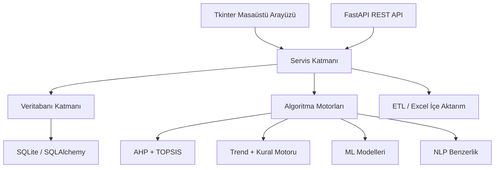

# Adil Seçmeli
## Proje Sunumu İçin Teknik Rapor

**Tarih:** 14 Nisan 2026  
**Hazırlanma amacı:** Bu rapor, projenin tamamını bir sunumda teknik ve savunulabilir şekilde anlatabilmeniz için hazırlanmıştır. Belge; sistemin amacı, mimarisi, veri akışı, kullanılan algoritmalar, teknik tercihler, bu tercihlerin nedenleri ve sunumda nasıl aktarılması gerektiğini tek yerde toplar.

---

## 1. Projenin Temel Amacı

Bu proje, üniversitelerde seçmeli ders planlama sürecini daha **adil, ölçülebilir ve veri temelli** hale getirmek için geliştirilmiştir.

Klasik durumda seçmeli dersler çoğu zaman:

- geçmiş performans verileri tam incelenmeden,
- öğrenci talebi düzenli ölçülmeden,
- dersler arası denge kurulmadan,
- fakülte ve bölüm kısıtları açık yönetilmeden

belirlenir.

Bu sistem ise karar sürecini şu soruya indirger:

**“Bir ders, gelecek yıl veya gelecek dönem müfredatta kalmalı mı, havuza mı alınmalı, dinlendirilmeli mi, yoksa yeniden mi önerilmelidir?”**

Bu soruya tek bir sezgisel cevap yerine, çok katmanlı bir karar mekanizması ile yanıt verilir:

- kriter verisi
- öğrenci başarısı
- ders popülerliği
- anket talebi
- geçmiş yılların trendi
- kontenjan ve çakışma gibi operasyonel kurallar
- fakülte ve bölüm bazlı kapsam yönetimi

Bu nedenle proje sadece bir arayüz değil, aynı zamanda bir **karar destek sistemi**dir.

---

## 2. Proje Neyi Çözüyor

Sistem aşağıdaki gerçek problemleri hedef alır:

1. **Seçmeli dersler öznel belirlenmesin.**  
   Karar, kişisel yorumdan çok veriye dayansın.

2. **Başarısız ve düşük talep gören dersler görünür olsun.**  
   Müfredatta sadece “alışkanlıkla kalan” dersler ayıklanabilsin.

3. **Yeni döneme otomatik öneri üretilebilsin.**  
   Hangi derslerin kalacağı, çıkacağı ve yerine neyin geleceği belirlenebilsin.

4. **Bölüm ve fakülte sınırları korunabilsin.**  
   Fakülte ortak havuzundan kontrolsüz ders taşınması engellensin.

5. **Süreç denetlenebilir olsun.**  
   Hangi kriter dosyasıyla, hangi kapsam için, hangi raporun üretildiği izlenebilsin.

---

## 3. Genel Mimari

Sistem katmanlı bir yapıda kurulmuştur. Bu tercih, kodun büyümesi durumunda bakım kolaylığı sağlar.

### 3.1 Katmanlar

| Katman | Dosya / Modül | Rolü |
|---|---|---|
| Arayüz | `app/main.py`, `app/ui/tabs/*` | Kullanıcı etkileşimi, kriter girişi, rapor, analiz |
| Servis | `app/services/*` | İş kuralları, algoritmalar, veri işleme |
| Veritabanı | `app/db/models.py`, `app/db/sqlite_db.py`, `app/db/schema_compat.py` | Kalıcı veri, şema uyumluluğu |
| API | `app/api/main.py`, `app/api/routes.py` | Harici sistem entegrasyonu |
| ETL | `app/services/*import*`, `app/etl/*` | Excel / şablon tabanlı veri yükleme |
| Test | `app/tests/*` | Kritik davranışların doğrulanması |

### 3.2 Bu mimari neden seçildi

- **Tkinter** seçildi çünkü masaüstü kullanım için hızlı prototip ve yerel kurulum avantajı sağlar.
- **FastAPI** seçildi çünkü ileride OBS, öğrenci işleri veya anket sistemleri ile servis entegrasyonu için uygundur.
- **Servis katmanı ayrıldı** çünkü algoritmaların GUI koduna gömülmesi bakım maliyetini artırır.
- **SQLite + SQLAlchemy** seçildi çünkü geliştirme ve demo ortamında düşük kurulum maliyeti sunar.
- **Şema uyumluluk katmanı eklendi** çünkü proje canlı veritabanı üzerinde evrilirken eski veri yapılarıyla çalışmaya devam etmek gerekir.

---

## 4. Temel Veri Modeli

Proje birden fazla veri kümesini birlikte yönetir. Bu nedenle tablo tasarımı sistemin omurgasıdır.

### 4.1 Ana varlıklar

| Varlık | Amaç |
|---|---|
| `Fakulte`, `Bolum`, `Ders` | Akademik yapı |
| `Mufredat`, `MufredatDers` | Resmî ders listeleri |
| `Havuz` | Müfredata alınmamış ama aday olan dersler |
| `Performans` | Başarı oranı, ortalama not gibi akademik metrikler |
| `Populerlik` | Talep, kayıt, kontenjan gibi ilgi metrikleri |
| `Anket*` tabloları | Öğrenci tercih sinyali |
| `Skor` | Hesaplanmış kesinleşme puanı |
| `ders_kriterleri` | Ders bazlı kriter girişi |
| `criteria_import`, `criteria_import_rows` | Belge tabanlı kriter yükleme izi |

### 4.2 Neden ayrı tablolar kullanıldı

- **Performans** ile **popülerlik** aynı şey değildir. Bir ders başarı açısından güçlü ama talep açısından zayıf olabilir.
- **Skor** ham veri değildir; hesap sonucu olduğu için ayrıca tutulur.
- **İçe aktarılan belge bilgisi** ayrıca saklanır; çünkü gerçek sistemlerde “bu veri hangi dosyadan geldi?” sorusu kritiktir.
- **Müfredat** ve **havuz** ayrı tutulur; çünkü biri aktif planı, diğeri aday uzayı temsil eder.

---

## 5. Uçtan Uca Veri Akışı

Bu proje sadece skor hesaplamaz; ham veriden rapora kadar tam bir akış kurar.

### 5.1 Veri akışının ana sırası

1. Excel veya şablon dosyaları sisteme yüklenir.
2. Dosyalar doğrulanır, kapsamı belirlenir.
3. Ders eşleştirme motoru satırları sistemdeki derslerle bağlar.
4. Performans, popülerlik, anket ve kriter verileri işlenir.
5. AHP ile kriter ağırlıkları alınır.
6. TOPSIS ile dersler puanlanır.
7. Kural motoru ve durum makinesi ile dersin kaderi belirlenir.
8. Gerekirse gelecek yıl müfredatı otomatik oluşturulur.
9. Raporlama servisi tek bir özet çıktıda tüm sonucu toplar.

### 5.2 Veri akışı neden bu sırada kuruldu

- Önce veri doğrulanır, sonra skor hesaplanır. Bu sayede hatalı Excel içeriği karar motoruna kirli veri taşımaz.
- Skor üretimi ile rapor üretimi ayrılmıştır. Böylece rapor ekranı her seferinde ham tablo mantığı kurmak zorunda kalmaz.
- İçe aktarma kayıtları ayrı saklandığı için veri soy kütüğü korunur.

---

## 6. Ana Karar Algoritmaları

Bu bölüm sunumun en kritik kısmıdır. Çünkü sistemin asıl değeri burada ortaya çıkar.

### 6.1 AHP: Kriter Ağırlıklandırma

**Kod merkezi:** `app/services/calculation.py`

Sistem dört temel kriteri birlikte ele alır:

- başarı
- trend
- popülerlik
- anket

AHP, bu kriterlerin birbirine göre önemini belirlemek için kullanılır.

#### Neden AHP kullanıldı

- Çünkü karar problemi çok kriterlidir.
- Her kriter aynı önemde değildir.
- Ağırlıkların rastgele verilmesi yerine sistematik verilmesi gerekir.
- AHP, uzman görüşünü sayısallaştırır.

#### Sistemde nasıl uygulanıyor

- Önceden tanımlı bir **Saaty ikili karşılaştırma matrisi** kullanılır.
- Özdeğer / özvektör yaklaşımı ile ağırlık vektörü üretilir.
- Tutarlılık oranı hesaplanır.
- `CR < 0.10` kabul edilebilir tutarlılık sınırı olarak ele alınır.

#### Neden iyi bir tercih

- Sunumda savunması kolaydır.
- Akademik literatürde yaygın kullanılır.
- “Başarı mı daha önemli, talep mi?” gibi nitel soruları sayısal modele çevirir.

#### Sınırlılığı

- Ağırlık matrisi yine uzman varsayımı taşır.
- Yani AHP tamamen nesnel değil, **kontrollü öznel** bir yöntemdir.

### 6.2 TOPSIS: Ders Sıralama ve Kesinleşme Puanı

**Kod merkezi:** `app/services/calculation.py`

AHP ile gelen ağırlıklar kullanılarak dersler TOPSIS ile puanlanır.

#### Neden TOPSIS kullanıldı

- Birden fazla kriteri aynı anda değerlendirmek gerekir.
- Dersleri tek tek değil, birbirlerine göre sıralamak gerekir.
- “İdeal derse en yakın, kötü derse en uzak” yaklaşımı anlaşılır ve pratiktir.

#### Sistemde nasıl uygulanıyor

1. Kriter sütunları normalize edilir.
2. AHP ağırlıkları uygulanır.
3. Pozitif ideal çözüm ve negatif ideal çözüm bulunur.
4. Her ders için iki ideale uzaklık hesaplanır.
5. Yakınlık katsayısı çıkarılır.
6. Sonuç 0-100 bandında kesinleşme puanına dönüştürülür.

#### Neden bu projeye uygun

- Seçmeli ders planlama bir **alternatif sıralama** problemidir.
- TOPSIS bu tip problemler için doğrudan uygundur.
- Hesaplaması görece hızlıdır.
- Karar mekanizması kullanıcıya açıklanabilir.

#### Neden tek başına yeterli değil

- TOPSIS sadece sıralama verir.
- Kontenjan, çakışma, dönem bağımlılığı, havuz durumu gibi operasyonel kısıtları tek başına çözmez.
- Bu yüzden sistemde TOPSIS üstüne ayrıca kural motoru ve durum makinesi kurulmuştur.

### 6.3 Trend Hesabı: Geçmişin Ağırlıklı Etkisi

**Kod merkezi:** `app/services/calculation.py`

Trend hesabı, son üç yılın başarı verisini ağırlıklı kullanır.

Varsayılan ağırlık mantığı:

- en yeni yıl: `%50`
- bir önceki yıl: `%30`
- daha önceki yıl: `%20`

#### Neden trend eklendi

- Tek yıl üzerinden karar vermek yanıltıcı olabilir.
- Bazı dersler geçici olarak düşebilir veya yükselebilir.
- Yakın geçmişin daha baskın olması gerekir.

#### Dikkat çeken teknik tercih

Eksik yıllar varsa ağırlıklar yeniden ölçeklenir. Yani veri yoksa ağırlık boşa gitmez; kalan yıllara dağıtılır.

#### Neden önemli

- Bu yaklaşım gerçek hayatta eksik verili ortamlarda daha dayanıklıdır.
- “Bir yıl veri eksik diye tüm trend çöpe gitmesin” mantığına dayanır.

### 6.4 Kural Tabanlı Düşürme Mantığı

**Kod merkezi:** `app/services/calculation.py`

Sistem bazı dersleri doğrudan puan eşiğine göre veya ek kurallarla müfredattan çıkarabilir.

Örnek yaklaşım:

- kesinleşme puanı düşükse
- ortalama not çok düşükse
- ders başarı ve talep açısından zayıfsa

ilgili ders müfredattan düşürülebilir.

#### Neden sadece skor kullanılmadı

- Aynı skoru alan iki dersin operasyonel etkisi farklı olabilir.
- Bazı durumlarda belirli eşikler politik olarak daha nettir.
- Bu yüzden sistemde “sıralama mantığı” ile “karar eşiği mantığı” birlikte kullanılır.

### 6.5 Yerine Ders Bulma Stratejisi

**Kod merkezi:** `app/services/calculation.py`, `app/services/dual_semester.py`

Bir ders çıkarıldığında sistem yerine gelecek adayı önce bölüm içinden, sonra gerekirse fakülte ortak havuzundan arar.

#### Neden bu sıra tercih edildi

- Öncelik bölümün kendi akademik kimliğini korumaktır.
- Fakülte ortak havuzu esnekliği artırır ama kontrolsüz kullanılırsa bölüm yapısını bozar.
- Bu yüzden sistem fakülte ortak havuzundan gelen ders sayısına üst sınır koyar.

#### Güçlü tarafı

- Tamamen serbest bir seçim yerine, kontrollü çeşitlilik sağlar.

### 6.6 Kural Motoru: Operasyonel Uygunluk Kontrolü

**Kod merkezi:** `app/services/rules_engine.py`

Bu modül, “skoru iyi ama uygulanabilir mi?” sorusunu cevaplar.

Kontrol edilen örnek kurallar:

- ders daha önce başarısız alınmış mı
- kontenjan dolu mu
- ders saatleri çakışıyor mu

#### Neden gerekli

- Karar destek sistemlerinde sadece akademik puan yetmez.
- Operasyonel uygulanabilirlik kontrolü yapılmazsa kullanıcı güveni düşer.

### 6.7 Havuz Durum Makinesi

**Kod merkezi:** `app/services/havuz_karar.py`

Havuzdaki bir ders zaman içinde farklı durumlar alabilir:

- müfredatta
- havuzda
- dinlenmede
- kalıcı iptal

Bu yapı klasik if-else yerine bir **durum makinesi** gibi tasarlanmıştır.

#### Neden durum makinesi mantığı kullanıldı

- Yıllar arasında tekrar eden kararlar vardır.
- Bir dersin geçmiş durumu sonraki kararını etkiler.
- Sayaç ve durum birlikte izlenmelidir.

#### Neden gerçek hayata uygun

- Akademik kararlar tek atımlık değildir; ders geçmişi önemlidir.
- Bir ders bir yıl çıkıp ertesi yıl hemen geri dönmemelidir.

### 6.8 Çift Dönem Planlama ve 4+4 Dengeleme

**Kod merkezi:** `app/services/dual_semester.py`

Sistem Güz ve Bahar dönemlerini ayrı ayrı ama ilişkili biçimde üretir.

#### Neden bu modül eklendi

- Yıllık planlama gerçekte dönem bazlı uygulanır.
- Aynı dersin iki dönemde yanlışlıkla tekrar etmesi engellenmelidir.
- 8 derslik yıllık kapasite varsa bunun dengeli biçimde 4+4 dağılması gerekir.

#### Çözdüğü problemler

- dönemler arası kopya ders
- bir dönemin aşırı yüklenmesi
- aynı bölüm için dengesiz dağılım
- durum ve sayaç bilgisinin dönem bazında bozulması

#### Neden değerli

- Bu modül projeyi sadece akademik analiz aracı olmaktan çıkarıp operasyonel planlama aracına dönüştürür.

---

## 7. Makine Öğrenmesi Modelleri

Makine öğrenmesi bu projede ana omurga değil, destekleyici analiz katmanıdır. Bu ayrımı sunumda özellikle vurgulamak gerekir.

**Kod merkezi:** `app/services/ai_engine.py`, `app/services/course_analyzer.py`

### 7.1 Linear Regression

#### Ne için kullanılıyor

- Dersin gelecekteki başarı eğilimini tahmin etmek

#### Neden seçildi

- Basit, hızlı ve yorumlanabilir
- Küçük veri setlerinde ilk referans model olarak uygundur
- Eğilim gösterme konusunda anlaşılır sonuç üretir

#### Ne zaman güçlü

- Özellikler ile çıktı arasında yaklaşık doğrusal ilişki olduğunda

### 7.2 Random Forest

#### Ne için kullanılıyor

- Kesinleşme puanı veya benzeri karmaşık ilişkileri tahmin etmek

#### Neden seçildi

- Doğrusal olmayan örüntüleri yakalayabilir
- Gürültülü veride tek ağaca göre daha kararlıdır
- Özellikler arası etkileşimleri daha iyi taşır

#### Neden bu projede mantıklı

- Ders başarısı, talep ve trend çoğu zaman doğrusal hareket etmez
- Random Forest bu karmaşıklığı daha iyi modelleyebilir

### 7.3 Decision Tree

#### Ne için kullanılıyor

- Ders statüsü veya karar açıklaması üretmek

#### Neden seçildi

- Karar yolları görsel olarak anlatılabilir
- Sunum ve açıklanabilirlik açısından çok değerlidir

#### Ana avantajı

- “Bu ders neden riskli çıktı?” sorusuna ağaç kuralı ile cevap verilebilir

### 7.4 Neden bu modeller ana üretim hattı değil

- Eğitim verisi miktarı her fakülte ve bölüm için yeterince yüksek olmayabilir.
- Kararların yönetsel olarak açıklanabilir olması gerekir.
- Bu nedenle canlı karar hattı daha çok **AHP + TOPSIS + kural motoru + durum makinesi** üstüne kurulmuştur.

Bu çok doğru bir tasarımdır; çünkü:

- çekirdek karar mekanizması deterministik kalır,
- ML ise ikinci görüş veya analitik destek rolü üstlenir.

---

## 8. NLP ve Benzerlik Analizi

**Kod merkezi:** `app/services/similarity.py`, `app/services/similarity_engine.py`, `app/ui/tabs/relations_tab.py`

Sistem ders açıklamalarını metin olarak da analiz eder.

### Kullanılan yöntem

- TF-IDF
- cosine similarity

### Neden TF-IDF seçildi

- Ders açıklamaları kısa ve teknik metinlerdir.
- Bu tip metinlerde kelime bazlı ağırlıklandırma hızlı ve etkilidir.
- Derin öğrenme tabanlı embedding yöntemlerine göre daha hafiftir.

### Neden cosine similarity seçildi

- İki ders açıklamasının yönsel benzerliğini iyi ölçer.
- Belge uzunluğundan daha az etkilenir.

### Kullanım amacı

- benzer dersleri bulmak
- müfredatta gereksiz tekrarları görmek
- havuzdan yerine önerilecek yakın dersleri tespit etmek

### Neden önemlidir

- Sadece sayısal veri değil, metinsel içerik de karar sürecine yardımcı olur.
- Böylece sistem “aynı isim değil ama çok benzer içerik” ilişkilerini de yakalayabilir.

---

## 9. Kayıt Eşleştirme ve Belge Tabanlı İçe Aktarım Teknikleri

Bu alan, projenin gerçek hayatta çalışabilirliği açısından en kritik bölümlerden biridir.

### 9.1 Ders Eşleştirme Motoru

**Kod merkezi:** `app/services/course_matcher.py`

Excel veya belge içinden gelen satırlar sistemdeki derslerle birebir örtüşmeyebilir. Bu yüzden eşleştirme çok katmanlı yapılır.

#### Kullanılan stratejiler

- ders kodunda tam eşleşme
- normalize edilmiş ders adında tam eşleşme
- gevşek anahtar ile esnek eşleşme

#### Neden böyle tasarlandı

- Gerçek Excel dosyalarında yazım farkı çok olur.
- Sadece kod ile eşleştirme yetersiz kalabilir.
- Sadece isim ile eşleştirme de risklidir.

Bu yüzden sistem kademeli ve kontrollü bir eşleştirme kullanır.

### 9.2 Kriter Dosyası İçe Aktarımı

**Kod merkezi:** `app/services/criteria_import_service.py`

Kriterler artık kapsam bazlı belgeyle sisteme alınabilir:

- fakülte
- isteğe bağlı bölüm
- yıl
- dönem

#### Neden bu tasarım seçildi

- Gerçek kurumlarda veriler çoğu zaman toplu dosya ile gelir.
- Manuel giriş büyük veri hacminde sürdürülebilir değildir.
- Ancak belge kaynağının saklanmaması denetim zafiyeti oluşturur.

Bu nedenle yeni yapı:

- dosyayı içeri alır,
- hangi kapsam için geldiğini kaydeder,
- satır bazlı sonucu saklar,
- aktif import bilgisini rapora yansıtır.

#### Neden çok önemli

- “Bu kriter verisi hangi dosyadan geldi?” sorusuna cevap verir.
- Fakülte geneli ve bölüm özelinde versiyonlamayı destekler.
- Raporun kaynağı şeffaf olur.

### 9.3 Müfredat ve Anket İçe Aktarım Servisleri

**Kod merkezi:** `app/services/curriculum_import_service.py`, `app/services/survey_import_service.py`

#### Kullanılan teknikler

- `pandas` ile Excel okuma
- şablon ve sürüm kontrolü
- satır doğrulama
- kapsam doğrulama
- hatalı satırların ayrı loglanması

#### Neden gerekli

- Üniversite sistemlerinden gelen veri mükemmel değildir.
- Dosya tabanlı entegrasyonlarda doğrulama yapılmazsa karar motoru bozulur.

---

## 10. Raporlama ve Tek Gerçek Kaynak Yaklaşımı

**Kod merkezi:** `app/services/reporting_service.py`

Rapor ekranı sadece tablo göstermemeli, hesap sonuçlarını anlamlı bir özette sunmalıdır.

Bu servis:

- skorları merkezileştirir,
- müfredat ve havuz görünümünü birleştirir,
- kriter dosyası özetini ekler,
- istatistik üretir,
- tek snapshot mantığı ile rapor ekranına veri verir.

### Neden bu yaklaşım seçildi

- Her UI ekranı kendi sorgu mantığını yazarsa tutarsızlık artar.
- Tek snapshot üretmek bakım maliyetini düşürür.
- Raporlar denetlenebilir hale gelir.

### Neden `skor` tablosu kritik

- Ham veri ile karar çıktısı birbirine karıştırılmaz.
- Raporlar anlık hesap yerine kalıcı sonuç üstünden ilerler.
- Üretim hattında “tek gerçek skor kaynağı” oluşur.

---

## 11. Şema Uyumluluğu ve Üretim Gerçekçiliği

**Kod merkezi:** `app/db/schema_compat.py`, `alembic/`

Bu projede önemli teknik kararlardan biri, veritabanı değişikliklerini yalnızca yeni kurulum için değil, yaşayan veri üzerinde de yönetmektir.

### Kullanılan yaklaşım

- Alembic ile migration mantığı
- runtime schema guard ile eksik kolon ve tabloları çalışma anında tamamlama

### Neden bu hibrit yaklaşım seçildi

- Akademik projelerde veritabanı şeması zamanla değişir.
- Eski demo verilerini silmeden yeni sürüme geçmek gerekir.
- Sadece manuel SQL güncelleme ile ilerlemek kırılgandır.

### Sağladığı fayda

- Geriye dönük uyumluluk
- geçiş maliyetinin azalması
- üretime daha yakın davranış

---

## 12. Kullanılan Teknolojiler ve Seçilme Sebepleri

| Teknoloji | Neden kullanıldı |
|---|---|
| Python | Hızlı geliştirme, veri işleme ve ML ekosistemi |
| Tkinter | Yerel masaüstü arayüz, düşük kurulum maliyeti |
| FastAPI | Modern API, Swagger dokümantasyonu, entegrasyon kolaylığı |
| SQLite | Geliştirme ve demo için hafif veritabanı |
| SQLAlchemy | ORM ve veri modeli standardizasyonu |
| pandas | Excel ve tablo bazlı veri işleme |
| numpy | Sayısal hesaplar ve matris işlemleri |
| scikit-learn | ML modelleri ve TF-IDF altyapısı |
| openpyxl | Excel şablonu üretme ve biçim koruma |
| matplotlib / seaborn | Analiz ekranları ve grafiksel görünüm |
| Alembic | Şema migration yönetimi |
| python-dotenv | Ortam bazlı yapılandırma |

---

## 13. Projede Kullanılan Teknik Yaklaşımlar

Bu başlıkta algoritma dışındaki mühendislik teknikleri özetlenir.

### 13.1 Katmanlı mimari

Arayüz, servis ve veritabanı ayrılmıştır. Bu sayede algoritma değişikliği arayüzü doğrudan bozmaz.

### 13.2 Tek sorumluluk prensibi

Örneğin:

- `criteria_import_service.py` sadece kriter importu ile ilgilenir.
- `reporting_service.py` rapor verisini toplar.
- `havuz_karar.py` durum geçişini yönetir.

Bu yapı test yazmayı ve bakım yapmayı kolaylaştırır.

### 13.3 Savunmacı programlama

Sistemde çok sayıda kontrol vardır:

- eksik kolon kontrolü
- şema guard
- normalize etme
- fallback mekanizması
- veri yoksa güvenli varsayılan kullanma

Bu yaklaşım özellikle Excel ve eski veritabanı ile çalışan projelerde çok değerlidir.

### 13.4 Audit ve izlenebilirlik

Yeni kriter import yapısında belge başlığı ve satır detayları tutulur. Bu, gerçek kurumsal sistem mantığına uygundur.

### 13.5 Açıklanabilir karar sistemi

Bu projede doğrudan “kara kutu yapay zekâ” yerine açıklanabilir modeller tercih edilmiştir. Bu seçim akademik yönetim süreçleri için doğrudur.

---

## 14. Güçlü Yönler

Sunumda özellikle vurgulanması gereken güçlü yönler şunlardır:

1. **Karar süreci çok kriterlidir.**  
   Sadece tek metrikle karar verilmez.

2. **Çekirdek algoritma açıklanabilirdir.**  
   AHP ve TOPSIS sunum ve savunma için uygundur.

3. **Operasyonel gerçeklik dikkate alınmıştır.**  
   Kontenjan, çakışma, dönem dengesi ve havuz kısıtları vardır.

4. **Belge tabanlı veri girişi desteklenmektedir.**  
   Gerçek hayattaki Excel akışlarına uygundur.

5. **Raporlama katmanı vardır.**  
   Karar ile çıktı arasında denetlenebilir bağlantı kurulmuştur.

6. **ML destek katmanı mevcuttur.**  
   Sistem sadece klasik kurallarla sınırlı değildir.

---

## 15. Sınırlılıklar ve Dürüstçe Söylenmesi Gerekenler

İyi bir sunum sadece güçlü yönleri değil, mevcut sınırları da net söylemelidir.

### 15.1 Veri kalitesi bağımlılığı

Sistem iyi veri ile iyi sonuç verir. Özellikle Excel kaynaklı veri hataları karar kalitesini düşürebilir.

### 15.2 ML tarafında veri miktarı sınırlı olabilir

Bazı fakülte veya bölümlerde eğitim verisi az olduğunda ML modeli güvenilir olmaz. Bu yüzden ML destekleyici rol üstlenmektedir.

### 15.3 SQLite üretim için sınırlı olabilir

Küçük ve orta ölçekli kullanım için yeterlidir; çok kullanıcılı, yüksek trafikli kurumsal kullanımda PostgreSQL benzeri bir sisteme geçiş gerekebilir.

### 15.4 Bazı ağırlıklar uzman bilgisiyle başlatılmıştır

AHP matrisi tamamen veri öğrenimli değil, uzman varsayımı da içerir. Bu bir zayıflık değil ama bilinçli bir tercihtir.

---

## 16. Sunumda Nasıl Anlatılmalı

Bu bölümü doğrudan sunum akışı olarak kullanabilirsiniz.

### 16.1 Önerilen sunum sırası

1. Problem tanımı  
   Üniversitelerde seçmeli ders planlaması çoğu zaman öznel ve dağınık yürür.

2. Çözüm yaklaşımı  
   Bu proje, veriye dayalı bir karar destek sistemi önerir.

3. Mimari  
   Tkinter arayüz, servis katmanı, veritabanı, API ve ETL akışı anlatılır.

4. Veri kaynakları  
   Performans, popülerlik, anket, kriter dosyaları ve müfredat verileri gösterilir.

5. AHP  
   Kriterlerin neden ve nasıl ağırlıklandığı anlatılır.

6. TOPSIS  
   Derslerin nasıl sıralandığı ve kesinleşme puanının nasıl üretildiği anlatılır.

7. Kural motoru ve havuz mantığı  
   Skorun tek başına yeterli olmadığı açıklanır.

8. Çift dönem planlama  
   Güz ve Bahar ayrımı ile 4+4 dengeleme anlatılır.

9. ML ve NLP destekleri  
   Sistem sadece klasik algoritmadan ibaret değil denir, ancak ana karar hattının deterministik olduğu vurgulanır.

10. Belge tabanlı import ve raporlama  
   Gerçek hayatta kullanılabilirlik ve izlenebilirlik burada gösterilir.

11. Sonuç ve katkı  
   Sistem öznel karar yerine denetlenebilir akademik planlama sunar.

### 16.2 Jüri karşısında güçlü savunma cümleleri

- “Bu sistem sadece skor üretmiyor, kararın kaynağını ve kapsamını da kayıt altına alıyor.”
- “Makine öğrenmesini çekirdek karar mekanizması değil, destekleyici analiz katmanı olarak konumladık.”
- “AHP ile uzman bilgisini sistematikleştirdik, TOPSIS ile alternatifleri sıraladık, kural motoru ile operasyonel gerçekliği koruduk.”
- “Belge bazlı kriter importu ve rapor ekranındaki kaynak özeti sayesinde denetim izi oluşturduk.”
- “Çift dönemli planlama modülü projeyi laboratuvar seviyesinden üretime daha yakın bir noktaya taşıdı.”

---

## 17. Kısa Sonuç

Bu proje teknik olarak üç seviyeyi aynı anda birleştirmektedir:

1. **Karar bilimi seviyesi**  
   AHP, TOPSIS, trend ve açıklanabilir ML kullanımı

2. **Kurumsal yazılım seviyesi**  
   veri modeli, import servisleri, API, raporlama, şema uyumluluğu

3. **Operasyonel planlama seviyesi**  
   havuz yönetimi, dönem dengesi, ders eşleştirme, kurallı müfredat üretimi

Bu nedenle proje yalnızca bir öğrenci projesi gibi değil, uygun genişletmelerle kurumsal kullanım yönüne ilerleyebilecek bir karar destek platformu olarak değerlendirilebilir.

---

## 18. Sunum İçin Son Mesaj

Sunum sırasında projeyi şu tek cümle ile özetleyebilirsiniz:

**“Adil Seçmeli, üniversitelerde seçmeli ders kararlarını veri, çok kriterli analiz, kural tabanlı kontrol ve izlenebilir belge yönetimi ile destekleyen bir akademik karar sistemidir.”**
