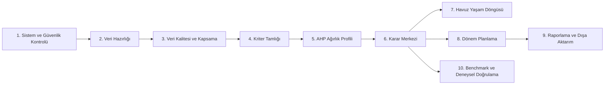

# Sistem Bütünlük ve Tasarım Raporu

Tarih: 2026-05-11  
Kapsam: Desktop GUI, FastAPI, servis katmanı, migration hattı, veri kalitesi, karar yönetimi, dönem planlama, benchmark ve güvenlik hazırlığı.

## 1. Yönetici Özeti

Sistem temel çalışma açısından sağlıklı görünüyor. Güncel doğrulamada `schema-check` başarılı, canlı SQLite veritabanı Alembic `20260512_0012` sürümünde, ana Python dosyaları compile oluyor ve tam test paketi `353 passed, 2 skipped` sonucuyla geçiyor.

Ancak ürün tasarımı açısından uygulama artık tek bir "sekme listesi" mantığının sınırını aşmış durumda. Ana pencerede 12 üst seviye sekme var; bazı sekmeler kendi içinde 5-10 alt iş akışı taşıyor. Bu yüzden teknik altyapı çalışsa da kullanıcı açısından doğru sıra ve ana senaryo netleşmezse sistem karmaşık algılanır.

Kısa karar:

- Teknik durum: Çalışır durumda, test ve şema doğrulaması temiz.
- Tasarım durumu: Modüller mantıklı parçalara ayrılmış, fakat navigasyon ve öncelik sırası yeniden düzenlenmeli.
- En iyi ürün senaryosu: Kullanıcı önce sistem/veri sağlığını görmeli, sonra veri hazırlığı, kriter/AHP ayarı, karar çalıştırma, dönem planlama ve raporlama adımlarını izlemeli.
- En önemli mimari risk: UI ve API içinde hala geçiş dönemi doğrudan SQLite/SQL kullanımları var; uzun vadede servis/repository sınırına taşınmalı.

## 2. Doğrulama Sonuçları

Bu rapor hazırlanırken çalıştırılan temel kontroller:

```text
env\Scripts\python.exe main.py --mode schema-check
```

Sonuç:

```text
DB yolu: data\adil_secmeli.db
DB mevcut: Evet
Şema sağlıklı: Evet
Alembic version: 20260512_0012
Runtime schema mutation: Açık
```

```text
env\Scripts\python.exe -m py_compile app\main.py main.py app\api\main.py app\api\routes.py
```

Sonuç: Başarılı.

```text
env\Scripts\python.exe -m pytest app\tests tests -q --tb=short
```

Sonuç:

```text
353 passed, 2 skipped in 32.08s
```

Kalan 2 skip, DB bağımlı API smoke testlerinde tutulmuş. Bu sistemin çalışmadığını göstermiyor; ancak ürün güveni için bu iki endpoint testi izole test DB fixture ile skip olmadan çalışır hale getirilmeli.

## 3. Mevcut Ana Sekme Sırası

`app/main.py` içinde mevcut üst seviye GUI sırası:

1. Tablo Görüntüle
2. Analiz & Grafik
3. Rapor & Yukleme
4. Veri Yönetimi
5. Hesaplama & Test
6. Karar Merkezi
7. AHP Ağırlık Yönetimi
8. Dönem Planlama
9. Veri Kalitesi
10. Benchmark Platformu
11. Sistem Sağlığı
12. Güvenlik & Üretim Hazırlığı

Bu sıra teknik olarak açılabilir durumda, fakat ürün akışı açısından ters bir izlenim veriyor. Sağlık, güvenlik, veri kalitesi ve veri hazırlığı gibi "ön koşul" ekranları sonda duruyor; kullanıcı ise ilk ekranda ham tablo görüntüleme ile karşılaşıyor. Bu, geliştirici/debug akışı için yararlı olabilir ama gerçek kullanım için ideal değil.

## 4. Mevcut Modül Haritası

### UI Katmanı

Ana UI yüzeyi:

- `ViewTab`: Ham tablo görüntüleme ve veri inceleme.
- `AnalysisTab`: Analiz ve grafikler.
- `ToolsTab`: Rapor/yükleme araçları.
- `DataManagementPage`: Import geçmişi, detay, satır sonucu, kalite kontrol, diff, rollback, karar etkisi.
- `CalcTab`: Kriter girişi, algoritma kontrol/ders lab, ders ilişkileri, havuz yönetimi.
- `DecisionCenterPage`: AHP profilleri, hazırlık kontrolü, karar politikaları, çalıştırmalar, ders kararları, havuz yaşam döngüsü, dönem planlama, hassas kararlar, akademik onay, adalet raporu.
- `AHPWeightPage`: AHP profil ve ağırlık yönetimi.
- `SemesterPlanningPage`: Güz/bahar planı, kısıt ihlalleri, alternatifler, plan geçmişi.
- `DataQualityPage`: Veri özeti, kapsama raporu, veri olgunluğu, eksik veri matrisi, doğrulama sorunları.
- `BenchmarkPanel`: Algoritma ve model karşılaştırma/lab yüzeyi.
- `SystemHealthPage`: Sistem ve schema sağlığı.
- `SecurityReadinessPage`: Güvenlik ve üretim hazırlığı.

### API Katmanı

FastAPI yüzeyi `app/api/main.py` üzerinden şu router gruplarını taşıyor:

- Genel veri okuma: dersler, skorlar, havuz, müfredat, akademik plan.
- Sistem: health, schema-health, architecture-audit, config-summary, SQL audit logları.
- Kriter tamlığı: durum, matrix, issues, validate, policy, task, override.
- Import governance: preview, validation, approve/reject, activate, diff, rollback, impact.
- Decision governance: AHP profiles, policies, runs, course decisions, fairness, sensitivity, data confidence.
- Havuz state machine: state policies, governance, transitions, approvals, overrides, lifecycle.
- AHP governance: criteria, profiles, validate/submit/approve/reject/activate/archive/clone, sensitivity, stale decisions.
- Semester planning: policies, availability, instructors, resources, prerequisites, generate, runs, report.
- Algorithm/benchmark/ML governance: algorithm registry, data guard, governed benchmark runs, ML readiness, features, model runs, predictions.
- Data quality: coverage, readiness, confidence, missing, validation issues, collection priorities, decision outcomes.
- Security: readiness, SQL console, secure imports, audit chain, backup.

### Servis Katmanı

Servis katmanı artık ana iş kurallarının çoğunu taşıyor:

- Karar: `decision_run_service`, `decision_policy_service`, `decision_outcome_service`, `decision_validation_service`.
- AHP: `ahp_profile_service`, `ahp_calculation_service`, `ahp_sensitivity_service`, `ahp_reporting_service`.
- Veri kalitesi: `data_coverage_service`, `data_readiness_service`, `data_confidence_service`, `missing_data_service`, `data_collection_priority_service`.
- Import: `criteria_import_service`, `curriculum_import_service`, `survey_import_service`, `import_*` servisleri.
- Havuz: `pool_state_machine_service`, `pool_state_policy_service`, `pool_state_validation_service`.
- Dönem planlama: `semester_planning_engine`, `semester_planning_policy_service`, `semester_workload_service`, `resource_planning_service`, `instructor_planning_service`.
- Benchmark/ML: `governed_benchmark_service`, `ml_*`, `algorithm_*`, `clustering_*`, `statistical_comparison_service`.
- Güvenlik/operasyon: `security_health_service`, `security_audit_service`, `secure_import_service`, `backup_restore_service`, `sql_console_service`.

Bu ayrım doğru yönde. Sorun, eski UI/API parçalarının tamamının henüz bu servis sınırına taşınmamış olması.

## 5. Doğru Yer ve Sıra Değerlendirmesi

### Doğru Yerde Olanlar

- Karar yönetimi artık ayrı bir `DecisionCenterPage` ve `decision_*` servisleri ile görünür hale gelmiş.
- AHP yönetimi ana karar hattından ayrılmış, ayrı servis ve UI sayfası var.
- Veri kalitesi ayrı sayfa ve API grubu olarak eklenmiş.
- Import, diff, rollback ve etki analizi ayrı bir veri yönetimi alanında toplanmış.
- Güvenlik ve üretim hazırlığı ayrı kontrol ekranı olarak eklenmiş.
- Alembic migration hattı güncel ve canlı DB sürümü biliniyor.
- Test kapsamı genişlemiş ve sistem seviyesinde regresyonları yakalayabilecek hale gelmiş.

### Yer/Sıra Açısından Sorunlu Olanlar

- `Sistem Sağlığı` ve `Güvenlik & Üretim Hazırlığı` sonlarda. Bunlar başlangıç kontrolü olmalı.
- `Veri Kalitesi`, `Veri Yönetimi`nden sonra ama karar çalıştırmadan önce görünür olmalı.
- `Tablo Görüntüle` ilk sekme. Bu ekran daha çok admin/debug ekranı; ana kullanıcı ilk burada başlamamalı.
- `AHP Ağırlık Yönetimi` hem ayrı üst sekme, hem `DecisionCenterPage` içinde AHP profilleri olarak temsil ediliyor. Biri özet/aktivasyon, diğeri detaylı editör rolüne indirgenmeli.
- `Dönem Planlama` hem ayrı üst sekme, hem karar merkezi içinde alt sekme olarak var. Tek canonical konum seçilmeli veya biri yalnızca kısa yol olmalı.
- `Hesaplama & Test` içinde kriter, algoritma lab, ilişkiler ve havuz aynı başlık altında duruyor. Bu başlık artık ürün iş akışını açıklamıyor.
- `Benchmark Platformu` güçlü ama ana karar yolu ile aynı seviyede durunca final karar motoru gibi algılanabilir. Asıl rolü karşılaştırma/lab/doğrulama olmalı.

## 6. Önerilen Ürün Akışı

En iyi senaryo, sistemi tek bir karar üretim hattı gibi göstermeli:



Kullanıcı açısından ideal akış:

1. Uygulamayı açınca sistem durumu görülür.
2. DB, migration, güvenlik ve üretim hazırlığı kontrolleri yeşil değilse karar çalıştırma önerilmez.
3. Veri yönetiminde müfredat, ders, anket ve kriter kaynakları içeri alınır.
4. Veri kalitesi ekranında kapsama, eksik veri, güven skoru ve olgunluk kontrol edilir.
5. Kriter tamlığı sağlanır; eksik bölüm/ders/yıl kombinasyonları tamamlanır veya onaylı override açılır.
6. AHP profilinde ağırlıklar, tutarlılık oranı ve aktif profil netleşir.
7. Karar merkezi, aktif politika + aktif AHP profil + hazır veri seti ile karar çalıştırır.
8. Ders kararları ve açıklamalar incelenir; hassas kararlar akademik onaya gider.
9. Havuz yaşam döngüsü kuralları karar çıktısını seçildi/elenen/korunan/reaktivasyon adayı gibi durumlara taşır.
10. Dönem planlama, kesinleşen karar çıktısından güz/bahar planı üretir.
11. Raporlama, yönetici/akademik kurul çıktısını üretir.
12. Benchmark ve ML ekranları karar kalitesini analiz eder; final karar hattının yerine geçmez.

## 7. Önerilen Yeni Navigasyon

Mevcut 12 üst seviye sekme yerine 6 ana grup daha anlaşılır olur:

### 1. Başlangıç

- Sistem Sağlığı
- Güvenlik & Üretim Hazırlığı
- Konfigürasyon özeti

Amaç: Kullanıcı daha veri girmeden sistemin karar çalıştırmaya hazır olup olmadığını görür.

### 2. Veri Hazırlığı

- Veri Yönetimi
- Veri Kalitesi
- Import geçmişi, diff, rollback, karar etkisi
- Eksik veri ve toplama öncelikleri

Amaç: Karar motoruna girecek verinin güvenilirliğini garanti eder.

### 3. Kriter ve Havuz

- Kriter Girdi İşlemleri
- Kriter Tamlığı
- Ders İlişkileri & Kurallar
- Havuz Yönetimi

Amaç: Karar öncesi akademik kuralları ve aday ders havuzunu hazırlar.

### 4. Karar

- AHP Ağırlık Yönetimi
- Karar Politikaları
- Karar Çalıştırmaları
- Ders Kararları
- Açıklama, hassasiyet, adalet, akademik onay

Amaç: Sistemin ana ürünü olan ders seçim/öncelik kararını üretir.

### 5. Planlama ve Raporlama

- Dönem Planlama
- Kısıt İhlalleri
- Alternatif Planlar
- Rapor & Export
- Analiz & Grafik

Amaç: Kararı uygulanabilir akademik plana ve rapora dönüştürür.

### 6. Geliştirici/Lab

- Tablo Görüntüle
- SQL Console
- Benchmark Platformu
- Algorithm Governance
- ML Readiness
- Dataset Lab

Amaç: Ana kullanıcı akışını bozmadan deneme, tanılama ve geliştirme yüzeylerini tutar.

## 8. Sekme Sırası İçin Minimum Düzeltme

Tam navigasyon refactor hemen yapılmayacaksa, mevcut sekmeler için daha iyi sıralama:

1. Sistem Sağlığı
2. Güvenlik & Üretim Hazırlığı
3. Veri Yönetimi
4. Veri Kalitesi
5. Hesaplama & Test
6. AHP Ağırlık Yönetimi
7. Karar Merkezi
8. Dönem Planlama
9. Rapor & Yukleme
10. Analiz & Grafik
11. Benchmark Platformu
12. Tablo Görüntüle

Bu minimum değişiklik bile kullanıcıya "önce hazır mıyız, sonra veri, sonra karar, sonra plan/rapor" sırasını hissettirir.

## 9. Mimari Sınırlar

Hedef mimari şu şekilde korunmalı:

```text
UI / API
  -> Service
    -> Repository / DB Gateway
      -> SQLAlchemy Models / SQLite
        -> Alembic Migration
```

Kurallar:

- UI ekranları iş kuralı yazmamalı; servis çağırmalı.
- API route dosyaları adapter gibi kalmalı; servis orchestration dışında SQL taşımamalı.
- Yeni schema değişiklikleri sadece Alembic migration ile eklenmeli.
- Runtime schema compatibility geliştirme/legacy güvenlik ağı olarak kalmalı; üretimde mümkünse kapatılmalı.
- Final karar hattı tek canonical servis hattından geçmeli: veri hazırlığı -> kalite -> kriter -> AHP -> karar -> havuz -> dönem planı.

Mevcut durumda `app/api/routes.py` ve bazı UI/servis dosyalarında doğrudan `sqlite3`, `cursor.execute`, `conn.execute` kullanımları devam ediyor. Bu şu an testleri kırmıyor ama uzun vadede bakım maliyeti ve schema uyumsuzluğu riskini artırıyor.

## 10. En İyi Senaryo Tanımı

Başarılı sistem kullanımının ölçülebilir hali:

1. Yeni kurulumda migration çalışır, `schema-check` sağlıklı döner.
2. GUI açılır ve başlangıçta sistem/veri readiness özetini gösterir.
3. Kullanıcı veri import eder; import preview, validation ve audit kaydı oluşur.
4. Import approve edilmeden aktif veri setine yazılmaz.
5. Veri kalitesi ekranında coverage, missing data, validation issues ve confidence değerleri görünür.
6. Kriter tamlığı, seçilen yıl/dönem/bölüm kapsamı için tamamlanır.
7. Aktif AHP profili tutarlılık kontrolünden geçer.
8. Aktif karar politikası ile decision run oluşturulur.
9. Her ders için skor, gerekçe, hassasiyet ve data confidence açıklaması üretilir.
10. Havuz state machine, karar sonuçlarını akademik onay ve koruma kurallarıyla işler.
11. Dönem planlama, kesinleşen adaylardan güz/bahar planı üretir ve ihlalleri listeler.
12. Raporlama ekranı akademik kurul/yönetim çıktısını üretir.
13. Benchmark/ML ekranları ana kararın doğrulama ve analiz tarafını destekler, kararın tek kaynağı olmaz.

## 11. Kalan Riskler

### Risk 1: Navigasyon karmaşıklığı

12 üst seviye sekme ve çok sayıda alt sekme, sistemin gücünü gösteriyor ama ana kullanım yolunu belirsizleştiriyor. Ana iş akışı ile lab/admin ekranları ayrılmalı.

### Risk 2: Çift temsil edilen ekranlar

AHP ve dönem planlama hem bağımsız sayfa hem karar merkezi içinde görünüyor. Bu, "hangi ekran asıl?" sorusunu doğurur. Birincil ekran ve kısa yol ilişkisi netleştirilmeli.

### Risk 3: Legacy SQL geçiş borcu

Doğrudan SQLite kullanımları hızlı geliştirme için çalışıyor, fakat schema büyüdükçe kırılgan hale gelir. Yeni geliştirmelerde servis/repository sınırı zorunlu olmalı.

### Risk 4: Runtime schema mutation üretim riski

`schema-check` runtime schema mutation'ın açık olduğunu gösteriyor. Bu geliştirme için faydalı; üretim hattında migration disiplini ile çakışabilir. Üretimde kapatma stratejisi belirlenmeli.

### Risk 5: Testlerde kalan skip'ler

2 API smoke testi DB bağımlılığı nedeniyle skip ediliyor. Bu testler izole fixture ile çalışır hale getirilmeli; yoksa endpoint regresyonları sessiz kalabilir.

### Risk 6: Dokümantasyon haritası güncel değil

`docs/MODUL_HARITASI.md` mevcut genişletilmiş sistemi yansıtmıyor. Yeni karar/veri kalitesi/AHP/dönem planlama/güvenlik/benchmark modülleri bu dosyaya işlenmeli veya bu rapor temel alınarak güncellenmeli.

## 12. Önerilen Uygulama Planı

### Faz 1: Navigasyon Netleştirme

- Ana sekme sırası minimum önerilen sıraya çekilsin.
- `Tablo Görüntüle`, `Benchmark Platformu`, SQL console ve lab ekranları "Geliştirici/Lab" grubuna alınsın.
- `Sistem Sağlığı` başlangıç ekranı yapılsın.

### Faz 2: Ana İş Akışı Ekranı

- Tek bir "Başlangıç / Dashboard" ekranı eklensin.
- Bu ekran şu readiness kartlarını göstersin:
  - DB ve migration sağlığı
  - Güvenlik hazırlığı
  - Veri kapsama
  - Kriter tamlığı
  - Aktif AHP profili
  - Aktif karar politikası
  - Son karar çalıştırması
  - Son dönem planı

### Faz 3: Çift Ekranları Rol Bazlı Ayırma

- `AHPWeightPage`: detaylı profil editörü.
- `DecisionCenterPage / AHP Profilleri`: sadece aktif profil seçimi ve özet.
- `SemesterPlanningPage`: canonical dönem planlama ekranı.
- `DecisionCenterPage / Dönem Planlama`: kısa yol veya son plan özeti.

### Faz 4: Mimari Borç Azaltma

- UI içindeki doğrudan DB erişimleri servis çağrılarına taşınsın.
- API route içinde kalan legacy SQL blokları servis/repository fonksiyonlarına bölünsün.
- `app/api/routes.py` domain bazlı route modüllerine ayrılabilir:
  - `decision_routes.py`
  - `data_quality_routes.py`
  - `import_routes.py`
  - `semester_planning_routes.py`
  - `ahp_routes.py`
  - `system_routes.py`

### Faz 5: E2E Happy Path Testi

Tek bir test, sistemin ana senaryosunu uçtan uca doğrulamalı:

1. Test DB oluştur.
2. Migration uygula.
3. Minimal ders/kriter/veri seti yükle.
4. Veri readiness üret.
5. AHP profilini aktive et.
6. Karar çalıştır.
7. Ders kararlarını doğrula.
8. Dönem planı üret.
9. Rapor endpointini doğrula.

Bu test geçerse "sistem bütün olarak çalışıyor" iddiası çok daha güçlü hale gelir.

## 13. Son Karar

Sistem şu an çalışır durumda; temel şema, test ve compile kontrolleri temiz. Genişleme yönü doğru: veri kalitesi, karar yönetişimi, AHP, havuz state machine, dönem planlama, güvenlik ve benchmark ayrı modüller olarak oluşmuş.

Asıl ihtiyaç artık hata düzeltmeden çok ürünleştirme ve akış sadeleştirme. En iyi sonraki adım, üst navigasyonu "sağlık -> veri -> kalite -> kriter/AHP -> karar -> plan -> rapor -> lab" sırasına çekmek ve bir başlangıç dashboard'u ile kullanıcıya karar çalıştırmaya hazır olup olmadığını tek ekranda göstermektir.
